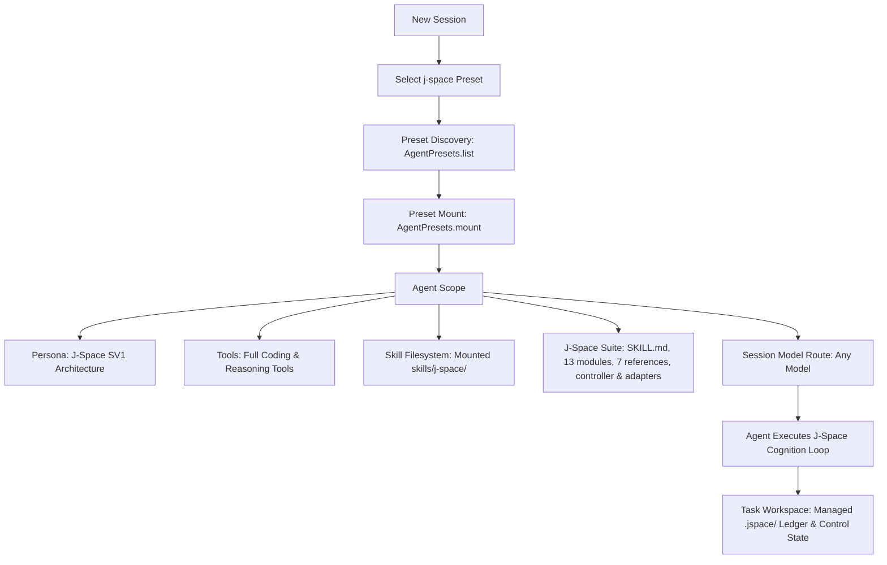

# dsh-j-space

[](https://dsh.market/?q=AnonyJcy%2Fdsh-j-space)
[](https://www.npmjs.com/package/@anonyjcy/dsh-j-space)
[](LICENSE)

[简体中文](README.md) | **English**

> **J-Space Cognition Suite SV1** native Agent Preset & standalone Cordis plugin for **DeepSeek Harness (DSH)**.  
> Bringing internal thought representations, externalized workspace ledgers (`.jspace/`), and adaptive verification to unlock full LLM reasoning potential.

---

> Compatibility: adapted to DSH 0.1.6 `dsh-workflow-ptc` and DSH 0.1.5 `dsh-persona` schema (`config.prefix` / `config.suffix`).

## 🌟 Overview

`dsh-j-space` integrates the [J-Space Cognition Suite](https://github.com/Tiger3807861189/J-Space-Cognition-Suite) (SV1 release, continuing V3.7 evolution) into DeepSeek Harness as a native **Agent Preset**.

Unlike traditional flat prompt injections, this plugin provides **full agent scope isolation, multi-tier reasoning routes, externalized workspace ledgers (`.jspace/`), and adaptive verification** across any compatible LLM model (DeepSeek, Claude, GPT, etc.).

---

## 📸 Screenshots & Preview

| DSH Preset Selection (Zero-Config) | J-Space Cognition Session in Action |
| :---: | :---: |
|  |  |

---

## 📊 Empirical Capability Realization Report

> Full evaluation reports by the original author:
> - Current Benchmark Report: [GLM-5.3-Flash-J-Space-Capability-Realization-Report](https://github.com/Tiger3807861189/GLM-5.3-Flash-J-Space-Capability-Realization-Report)
> - Earlier Comparative Report (Preserved Archive): [DeepSeek-V4-J-Space-Capability-Realization-Report](https://github.com/Tiger3807861189/DeepSeek-V4-J-Space-Capability-Realization-Report)

### 🔬 Benchmark 1: GLM-5.3-Flash Evaluation (Latest Report)

#### 1. Main Benchmark Table (Accuracy Comparison)

| Benchmark | GLM-5.3-Flash (Baseline) | GLM-5.3-Flash **+ J-Space V3.7/SV1**† | GLM-5.3 | Opus-5 | Fable 5.1 |
| :--- | :---: | :---: | :---: | :---: | :---: |
| **HLE (w/ tools)** | 55.3 | **59.2** | 62.5 | 64.7 | 65.0 |
| **Terminal Bench 2.1** | 84.3 | **88.8** | 88.2 | *89.1 | *91.4 |
| **DeepSWE v1.1** | 63.4 | **68.0** | 66.9 | 68.8 | 67.4 |
| **Agents' Last Exam** | 26.3 | **30.5** | 28.5 | 31.6 | — |
| **AutomationBench (Public)** | 48.8 | **51.1** | 48.2 | 50.3 | — |

*\* Note: Terminal Bench 2.1 figures for Opus-5 and Fable 5.1 are independently measured by a third party; no official entries exist.*  
*\† Estimated, based on limited controlled experiments.*

#### 2. Speed and Token Efficiency Table (GAIA Controlled Pair)

| Metric | Factor / Improvement |
| :--- | :---: |
| **Speed** | **1.87×** |
| **Token Efficiency** | **1.41×** |

---

### 🔬 Benchmark 2: DeepSeek-V4-Flash Evaluation (Historical Archive)

- **Base Model**: `DeepSeek-V4-Flash-Vision-Exp`
- **Harness**: DeepSeek Harness (Standard Mode)
- **Methodology**: Rigorous **A/B Testing** with and without J-Space on authoritative benchmark subsets and same-type mini-sets (Terminal-Bench 2.1: 20 medium / 10 hard; DeepSWE: 10 TypeScript / 10 Python / 10 Go / 2 JavaScript / 2 Rust; GAIA: level 1 / level 3, etc.), with identical model, environment, and sampling — only the J-Space toggle differs.
- **Evaluation Dimensions**: ① Accuracy / Pass Rate; ② Wall-clock & Token Efficiency.

#### 1. Main Benchmark Table (Accuracy Comparison)

| Benchmark | DeepSeek V4-Flash (Baseline) | DeepSeek V4-Flash **+ J-Space V3.7** | GLM-5.3 | Kimi-K3 | Opus-4.8 | Fable 5 (w/ fallback) |
| :--- | :---: | :---: | :---: | :---: | :---: | :---: |
| **HLE (w/o tools)** | *37.8 | **37.8** | — | 43.5 | 49.8 | 53.3 |
| **HLE (w/ tools)** | *51.5 | **51.9** | 62.5 | 56.0 | 57.9 | 63.0 |
| **Terminal Bench 2.1** | 83.9 | **85.5** | 88.2 | 88.3 | 85.0 | 88.0 |
| **NL2Repo** | 57.7 | **60.4** | 58.0 | 58.0 | 69.7 | — |
| **CyberGym** | 75.3 | **77.8** | 84.5 | 80.0 | 78.3 | 83.1 |
| **DeepSWE** | 59.3 | **61.8** | 66.9 | 67.5 | 58.0 | 70.0 |
| **Toolathlon-Verified** | 75.9 | **77.4** | 73.0 | 76.5 | 76.2 | 77.9 |
| **Agents' Last Exam** | 27.3 | **28.3** | 28.5 | 27.6 | 25.7 | 23.8 |
| **AutomationBench (Public)** | 25.7 | **27.6** | 48.2 | 30.8 | 27.2 | 29.1 |
| **⭐ Average Score** | 56.99 | **58.61** | 64.54 | 60.96 | 58.33 | 62.13 |

*\* Note: HLE scores were not disclosed and follow DeepSeek V4-Flash-0731. The average covers the 7 rows where all six columns have values.*

#### 2. Speed and Token Efficiency Table

| Benchmark | Wall-clock τ | Speedup | Output Tokens | Total Tokens | **Score per Unit Time** | Cost per Successful Task |
| :--- | :---: | :---: | :---: | :---: | :---: | :---: |
| **HLE (w/o tools)** | *1.02 | −2% | −10% | +5% | **0.98×** | +5% |
| **HLE (w/ tools)** | 0.88 | **+14%** | −22% | +3% | **1.15×** | +2% |
| **Terminal Bench 2.1** | 0.79 | **+27%** | −28% | −3% | **1.29×** | **−5%** |
| **DeepSWE** | 0.78 | **+28%** | −28% | −3% | **1.34×** | **−7%** |
| **Toolathlon-Verified** | 0.86 | **+16%** | −25% | +2% | **1.19×** | +0% |
| **AutomationBench (Public)** | 0.76 | **+32%** | −31% | −5% | **1.41×** | **−12%** |

*\* Note: For HLE (w/o tools), τ=1.02 is **intentionally positive** (i.e. slower) because on single-turn tasks without tools, injecting the full skill entry is net overhead. On long-horizon and multi-turn coding/agentic benchmarks (e.g. Terminal Bench, DeepSWE, AutomationBench), J-Space delivers **+14% ~ +32% faster execution**, **cuts 28%~31% of output token redundancy**, and boosts score per unit time by **1.15× ~ 1.41×**.*

---

## 🚀 Installation & Deployment

### Method 1: Install from npm / pnpm (Official Registry)

```bash
# via npm
npm install -D @anonyjcy/dsh-j-space

# via pnpm
pnpm add -D @anonyjcy/dsh-j-space

# Deploy preset to ~/.dsh/.agent-presets/j-space
npx @anonyjcy/dsh-j-space install
```

### Method 2: Direct Clone & Install (Local Use)
```bash
git clone https://github.com/AnonyJcy/dsh-j-space.git
cd dsh-j-space

# Deploy J-Space preset to ~/.dsh/.agent-presets/j-space/
node bin/cli.js install

# Check status
node bin/cli.js status
```

---

## 💡 Usage

### 1. In DeepSeek Harness Web UI
1. Create a new Session.
2. Select **J-Space Cognition Suite** in the **Agent Preset** dropdown.
3. Pick any compatible model (`deepseek-chat`, `deepseek-reasoner`, etc.) and start your task.

### 2. In DeepSeek Harness CLI
```bash
dsh --preset j-space "Analyze this architecture and implement feature X"
```

### 3. In Cordis Composition (`cordis.yml`)
```yaml
- id: j-space-plugin
  name: '@anonyjcy/dsh-j-space'
  config:
    autoDeploy: true
```

---

## 🧩 Architecture & Data Flow



---

## 🛠️ CLI Commands

```bash
node bin/cli.js install    # Deploy J-Space preset to ~/.dsh/.agent-presets/j-space
node bin/cli.js uninstall  # Cleanly remove J-Space preset
node bin/cli.js verify     # Verify integrity of installed preset files
node bin/cli.js status     # Display current installation status
```

---

## 📄 License

MIT License. See [LICENSE](./LICENSE) and [THIRD_PARTY_NOTICES.md](./preset/skills/j-space/THIRD_PARTY_NOTICES.md).

## Maintenance

See [CHANGELOG.md](CHANGELOG.md) for release notes.
