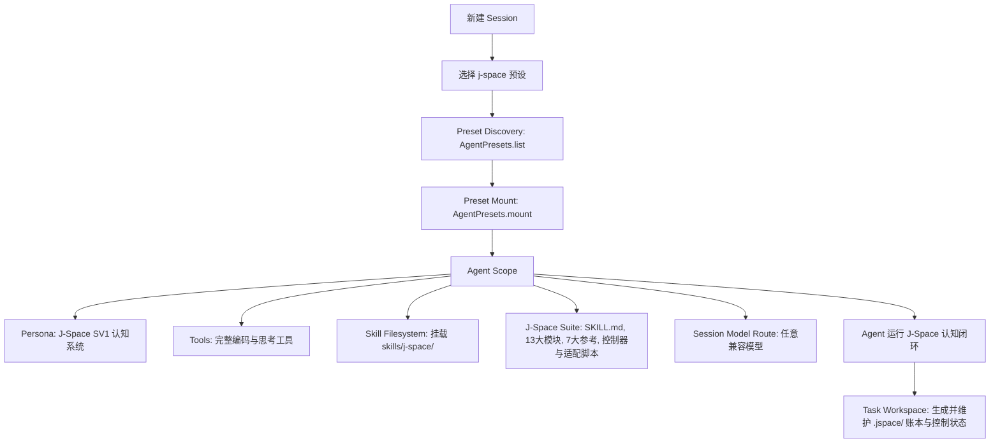

# 🚀 dsh-j-space

[](https://dsh.market/?q=AnonyJcy%2Fdsh-j-space)
[](https://www.npmjs.com/package/@anonyjcy/dsh-j-space)
[](LICENSE)

**简体中文** | [English Version](README.en.md)

> **J-Space Cognition Suite SV1** 原生 DeepSeek Harness (DSH) Agent Preset 预设与独立 Cordis 插件包。  
> 注入内部表征认知路由、持久控制器（`control.py`）、工作区状态外化账本（`.jspace/`）与自适应检验，全面释放大语言模型推理潜能。

---

> 兼容：已适配 DSH 0.1.6 的 `dsh-workflow-ptc` 与 DSH 0.1.5 的 `dsh-persona` schema（`config.prefix` / `config.suffix`）。

## 🌟 项目简介

`dsh-j-space` 将 [J-Space Cognition Suite](https://github.com/Tiger3807861189/J-Space-Cognition-Suite)（SV1 发布版，延续 V3.7 演进路线）完整集成为 DeepSeek Harness 的一等公民 **Agent 预设 (Preset)**。

它不是粗暴的 Prompt 拼接，而是真正参与 Cordis **Agent Scope 生命周期隔离、多层认知路由、持久控制器、工作区状态外化账本（`.jspace/`）与自适应验证** 的完整体系，完全解耦并兼容任意大语言模型（DeepSeek-Chat、DeepSeek-Reasoner、Claude、GPT 等）。

### ✨ 核心特性
1. **即插即用（Zero-Config Preset）**：部署预设后，DeepSeek Harness 会话创建菜单自动出现 `J-Space Cognition Suite` 预设。
2. **全生命周期 Scope 隔离**：遵循 Cordis 作用域规范，工具和认知技能严格限定在 J-Space Agent 会话中，不污染其他预设。
3. **持久控制器与状态外化（Active Control & Ledger）**：包含 SV1 的持久控制器（`control.py`）、宿主适配器（`host_bridge.py`）以及轻量级账本（`jspace.py`），在任务工作区（`cwd`）维护 `.jspace/`，实现目标跟踪、接缝审计（Seam）、自检断言、代码语义地图与断点恢复。
4. **全面扩展的 13 大认知与工程模块**：除原版的容量控制、深层推理、定向聚焦等模块外，SV1 引入了 `cyber`（安全分析）、`epistemics`（认识论与信念检验）、`orchestration`（多智能体编排）和 `repository`（代码仓库工程语义地图）。
5. **模型解耦与动态路由**：无缝适配各类基底模型，动态解析模型路由与工作区上下文。

---

## 📸 运行与效果预览

| DSH 预设选择（即插即用） | J-Space 认知工作流实况 |
| :---: | :---: |
|  |  |

---

## 📊 实验与评测数据报告（实测对比）

> 完整实测报告引自原作者测试发布：
> - 现行基准报告：[GLM-5.3-Flash-J-Space-Capability-Realization-Report](https://github.com/Tiger3807861189/GLM-5.3-Flash-J-Space-Capability-Realization-Report)
> - 早期对照报告（保留存档）：[DeepSeek-V4-J-Space-Capability-Realization-Report](https://github.com/Tiger3807861189/DeepSeek-V4-J-Space-Capability-Realization-Report)

### 🔬 评测一：GLM-5.3-Flash 实测对比（最新报告）

#### 1. 主基准测试准确率对比（Main Benchmark Table）

| Benchmark 基准测试 | GLM-5.3-Flash (基线) | GLM-5.3-Flash **+ J-Space V3.7/SV1**† | GLM-5.3 | Opus-5 | Fable 5.1 |
| :--- | :---: | :---: | :---: | :---: | :---: |
| **HLE (w/ tools)** | 55.3 | **59.2** | 62.5 | 64.7 | 65.0 |
| **Terminal Bench 2.1** | 84.3 | **88.8** | 88.2 | *89.1 | *91.4 |
| **DeepSWE v1.1** | 63.4 | **68.0** | 66.9 | 68.8 | 67.4 |
| **Agents' Last Exam** | 26.3 | **30.5** | 28.5 | 31.6 | — |
| **AutomationBench (Public)** | 48.8 | **51.1** | 48.2 | 50.3 | — |

*\* 注：Terminal Bench 2.1 的 Opus-5 与 Fable 5.1 为第三方独立测评，无官方数据。*  
*\† 为基于有限对照实验的估算值。*

#### 2. 速度与 Token 消耗效率对比 (GAIA 对照)

| 指标维度 | 提升比率 / 效果 |
| :--- | :---: |
| **运行速度 (Speed)** | **1.87×** |
| **Token 效率 (Token Efficiency)** | **1.41×** |

---

### 🔬 评测二：DeepSeek-V4-Flash 实测对比（历史存档）

- **评测基底**：`DeepSeek-V4-Flash-Vision-Exp`
- **运行环境**：DeepSeek Harness (标准模式)
- **评测方式**：对权威基准子集与同类型小集（Terminal-Bench 2.1 中 medium 20 / hard 10，DeepSWE 中 TypeScript 10 / Python 10 / Go 10 / JavaScript 2 / Rust 2，GAIA 中 level1 / level3 等）进行严格的 **有/无 J-Space 臂对照（A/B Testing）**，同模型、同环境、同采样参数，仅切换 J-Space 接入。
- **测算维度**：① 准确率（Accuracy）；② 墙钟与 token 效率（Wall-Clock & Token Efficiency）。

#### 1. 主基准测试准确率对比（Main Benchmark Table）

| Benchmark 基准测试 | DeepSeek V4-Flash (基线) | DeepSeek V4-Flash **+ J-Space V3.7** | GLM-5.3 | Kimi-K3 | Opus-4.8 | Fable 5 (w/ fallback) |
| :--- | :---: | :---: | :---: | :---: | :---: | :---: |
| **HLE (w/o tools)** | *37.8 | **37.8** | — | 43.5 | 49.8 | 53.3 |
| **HLE (w/ tools)** | *51.5 | **51.9** | 62.5 | 56.0 | 57.9 | 63.0 |
| **Terminal Bench 2.1** | 83.9 | **85.5** | 88.2 | 88.3 | 85.0 | 88.0 |
| **NL2Repo** | 57.7 | **60.4** | 58.0 | 58.0 | 69.7 | — |
| **CyberGym** | 75.3 | **77.8** | 84.5 | 80.0 | 78.3 | 83.1 |
| **DeepSWE** | 59.3 | **61.8** | 66.9 | 67.5 | 58.0 | 70.0 |
| **Toolathlon-Verified** | 75.9 | **77.4** | 73.0 | 76.5 | 76.2 | 77.9 |
| **Agents' Last Exam** | 27.3 | **28.3** | 28.5 | 27.6 | 25.7 | 23.8 |
| **AutomationBench (Public)** | 25.7 | **27.6** | 48.2 | 30.8 | 27.2 | 29.1 |
| **⭐ 综合均分 (Average)** | 56.99 | **58.61** | 64.54 | 60.96 | 58.33 | 62.13 |

*\* 注：HLE 数据未披露，沿用 DeepSeek V4-Flash-0731。综合均分覆盖六列均有值的 7 个项目行。*

#### 2. 速度与 Token 消耗效率对比（Speed & Token Efficiency）

| Benchmark 基准测试 | 墙钟时间比 τ | 提速幅度 | 输出 Token 变化 | 总 Token 变化 | **单位时间得分 (产出比)** | 每成功任务成本 |
| :--- | :---: | :---: | :---: | :---: | :---: | :---: |
| **HLE (w/o tools)** | *1.02 | −2% | −10% | +5% | **0.98×** | +5% |
| **HLE (w/ tools)** | 0.88 | **+14%** | −22% | +3% | **1.15×** | +2% |
| **Terminal Bench 2.1** | 0.79 | **+27%** | −28% | −3% | **1.29×** | **−5%** |
| **DeepSWE** | 0.78 | **+28%** | −28% | −3% | **1.34×** | **−7%** |
| **Toolathlon-Verified** | 0.86 | **+16%** | −25% | +2% | **1.19×** | +0% |
| **AutomationBench (Public)** | 0.76 | **+32%** | −31% | −5% | **1.41×** | **−12%** |

*\* 注：HLE (w/o tools) 的 τ=1.02 是**有意为正**（即单轮无工具任务下略微变慢），因为在单轮短任务中注入完整的技能条目是净开销；而在长链路、多轮工具交互任务中（如 Terminal Bench、DeepSWE、AutomationBench），J-Space 认知套件带来 **+14% ~ +32% 的大幅提速**、**降低 28%~31% 的输出 Token 冗余**，单位时间产出比提升高达 **1.15× ~ 1.41×**。*

---

## 🚀 安装与一键部署

本插件内置了开箱即用的原生 Node.js CLI 工具，无需额外安装其他依赖即可直接执行安装：

### 方式一：通过 npm / pnpm 安装（官方源）

```bash
# npm 安装
npm install -D @anonyjcy/dsh-j-space

# pnpm 安装
pnpm add -D @anonyjcy/dsh-j-space

# 运行 CLI 一键部署预设
npx @anonyjcy/dsh-j-space install
```

### 方式二：克隆仓库直接安装（本地使用）

```bash
git clone https://github.com/AnonyJcy/dsh-j-space.git
cd dsh-j-space

# 一键部署预设到 ~/.dsh/.agent-presets/j-space
node bin/cli.js install

# 检查安装状态与完整性
node bin/cli.js status
```

---

## 💡 使用方法

### 1. Web UI 界面
1. 打开 DeepSeek Harness Web 界面，点击 **New Session**（新建会话）。
2. 在 **Agent Preset** 下拉选单中，直接选择 **J-Space Cognition Suite**。
3. 选择任意兼容的模型（`deepseek-chat` / `deepseek-reasoner` 等）开始任务。

### 2. CLI 命令行
```bash
dsh --preset j-space "全面重构此模块并补充单元测试"
```

### 3. Cordis 配置文件组装 (`cordis.yml`)
```yaml
- id: j-space-plugin
  name: '@anonyjcy/dsh-j-space'
  config:
    autoDeploy: true
```

---

## 🧩 核心架构与数据流



---

## 🛠️ CLI 命令一览

```bash
node bin/cli.js install    # 安装 J-Space Preset 到 DSH 用户预设目录 (~/.dsh/.agent-presets/j-space)
node bin/cli.js uninstall  # 干净卸载 J-Space Preset
node bin/cli.js verify     # 校验已安装预设的套件完整性
node bin/cli.js status     # 查看当前安装状态与配置路径
```

---

## 📄 开源许可证

本项目基于 [MIT License](./LICENSE) 开源。套件第三方声明见 [THIRD_PARTY_NOTICES.md](./preset/skills/j-space/THIRD_PARTY_NOTICES.md)。

## 维护 / Maintenance

版本变更见 [CHANGELOG.md](CHANGELOG.md)。
